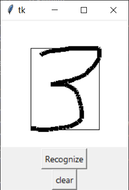
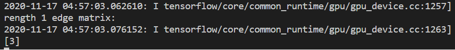

## MNIST with UI!

Welcome to Tensorflow MNIST!
I started to learn Tensorflow2 a couple of weeks ago. I tried to run the first and famous MNIST learning samples. I was able to get them train CNN based models on my local. It says over 99% accuracy with test images.  
But wanted to check how it works with my own handwritings.

### Train the model
I used the model described at [Martin's tutorial](https://github.com/GoogleCloudPlatform/tensorflow-without-a-phd/blob/master/tensorflow-mnist-tutorial/keras_05_mnist_batch_norm.ipynb)
And the final model is saved to `models` folder

### Add the UI 
Now I need UI to accept user handwriting. 
Used Tkinter, PIL frameworks to add a window and hand-drawing panel on it. 
 
### Normalize the Images
Drawing on the canvas is resized to 28 x 28 and fed to trained model but the accuracy was below 60%. It couldn't recognize the obvious drawings.
So as directed [here](http://yann.lecun.com/exdb/mnist/), I added normalization of images.

> The original black and white (bilevel) images from NIST were size
> normalized to fit in a 20x20 pixel box while preserving their aspect
> ratio. The resulting images contain grey levels as a result of the
> anti-aliasing technique used by the normalization algorithm. the
> images were centered in a 28x28 image by computing the center of mass
> of the pixels, and translating the image so as to position this point
> at the center of the 28x28 field.

### Pretty high Accuracy

